# SVD Image Compression

Lossy image compression in C using truncated SVD. You give it an image and a rank K; it throws away everything except the top K singular triplets per channel and reconstructs from those.

## How it works

Each channel (R, G, B) is an m×n matrix. The algorithm runs Lanczos iteration on A^T A to get an approximate eigendecomposition, then recovers singular vectors and reconstructs:
```
 ≈ Σ_{i=1}^{K} σᵢ · uᵢ · vᵢᵀ
```
Small K = aggressive compression. The reconstructed values are rescaled to [0, 255] before writing out. For grayscale images, one channel is computed and the result is copied to all three.

The SVD solver is handwritten. Lanczos for dimensionality reduction, implicit QR shifts (Givens rotations) for the tridiagonal eigenproblem. No LAPACK, no external math libs beyond `<math.h>`.

## Build

Needs `stb_image.h` and `stb_image_write.h` in the same directory (single-header libs, already included in the repo).

```bash
gcc main.c image.c svd.c -o compress -lm
```

## Usage

Run `./compress`. It prompts for three things:
```
Enter the value of K: 50
Enter Image File name with format: einstein.jpg
Enter where to output the image: einsteink50.ppm

```
Output is always PPM (P6 binary). Convert with ImageMagick if needed:

```bash
convert einsteink50.ppm einsteink50.jpg
```

## Results

### Grayscale — Einstein

| Original | K=10 | K=20 | K=50 | K=100 |
|----------|------|------|------|-------|
|  | 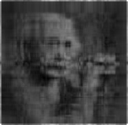 | 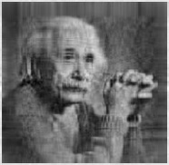 | 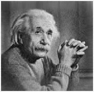 | 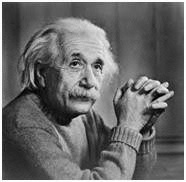 |

### RGB — Globe

| Original | K=10 | K=20 | K=50 | K=100 | K=200 |
|----------|------|------|------|-------|-------|
| 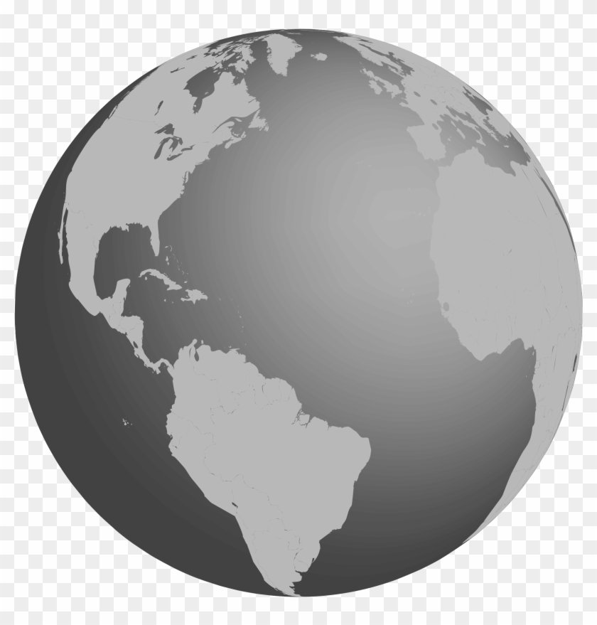 | 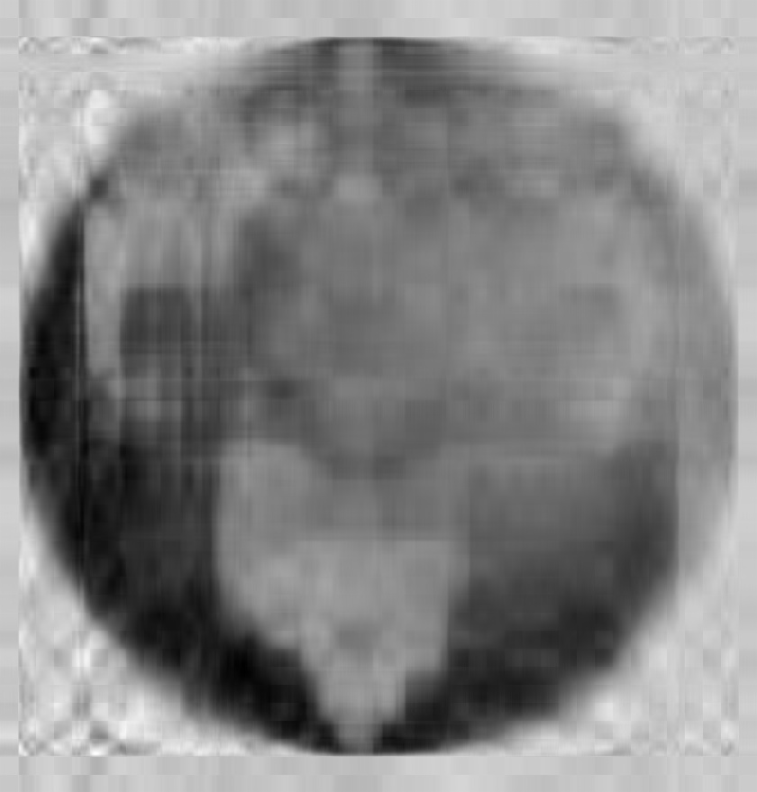 | 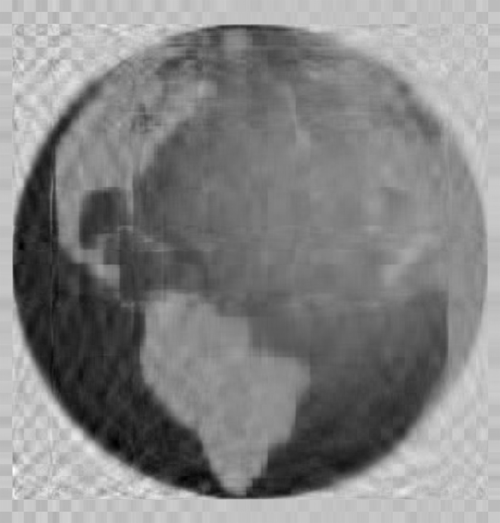 |  |  | 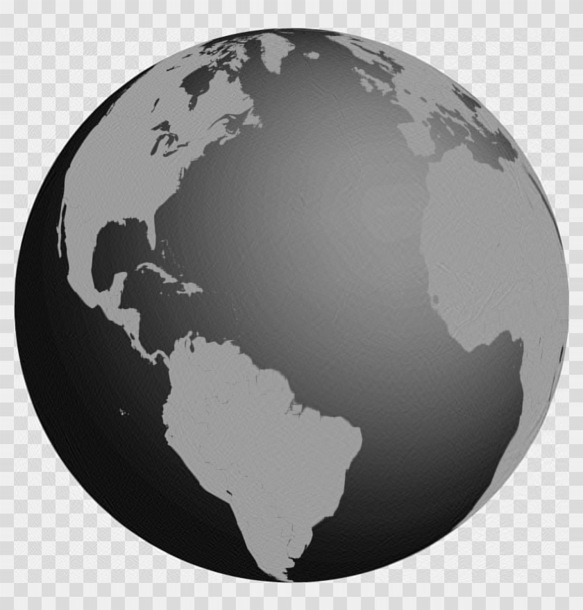 |

### Grayscale — Greyscale image

| Original | K=10 | K=20 | K=50 | K=100 | K=200 |
|----------|------|------|------|-------|-------|
| 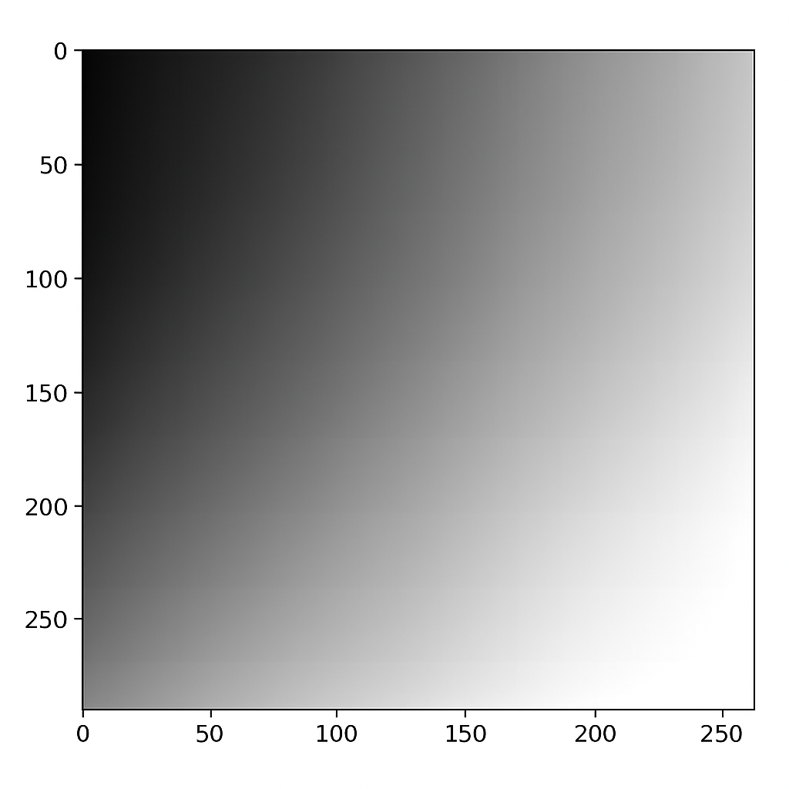 |  | 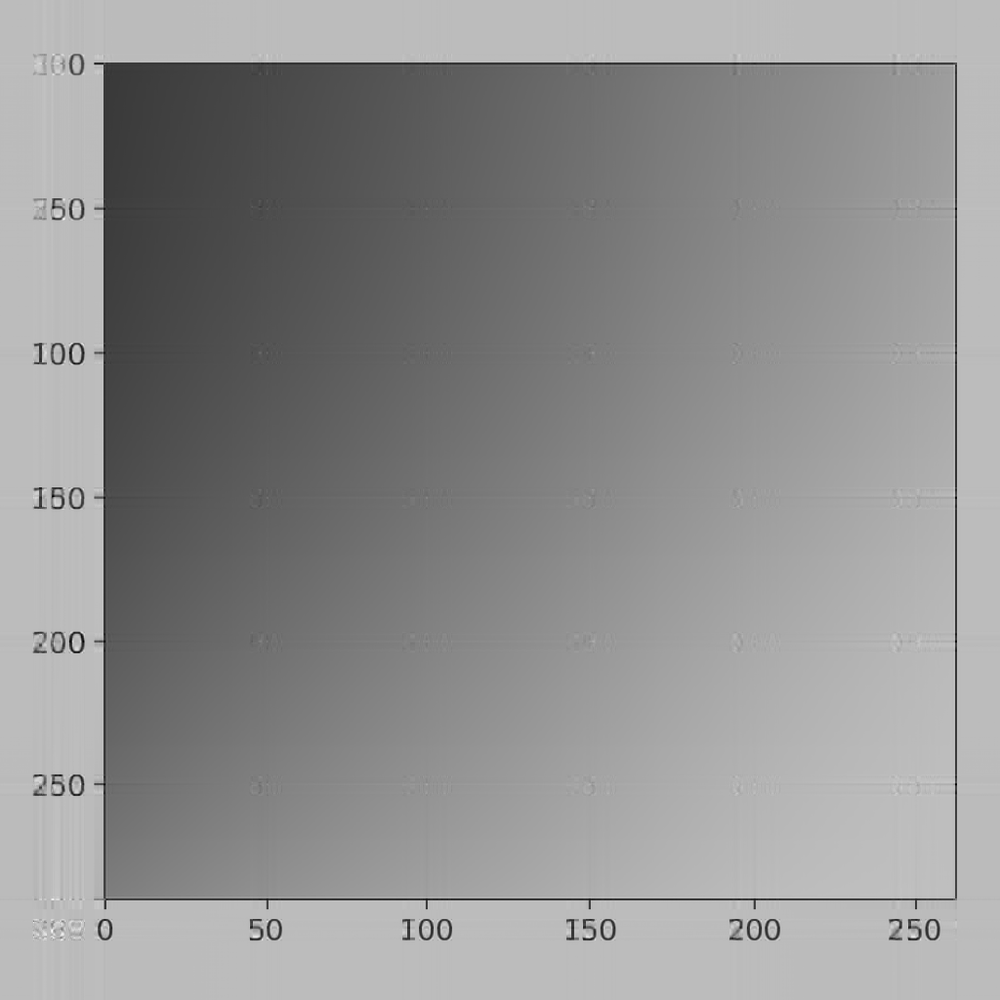 | 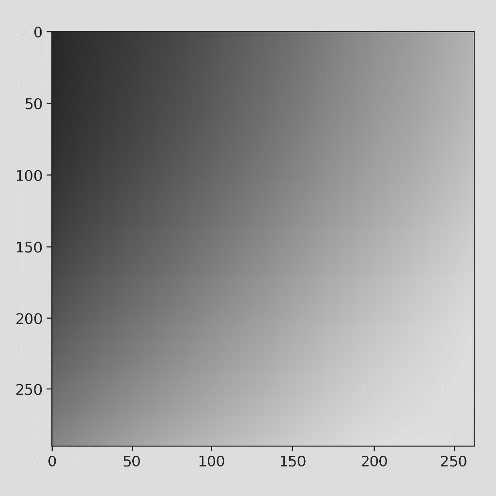 |  |  |

RGB images need a higher K than grayscale to look comparable with three independent compressions, each with more structure to capture.

## File breakdown

- `main.c` — reads image, detects grayscale, dispatches per channel
- `svd.c` — Lanczos iteration (`loop`), implicit QR (`GRot`), full compression pipeline (`channel`)
- `image.c` — thin wrappers around stb_image for read, and PPM write
- `svd.h`, `image.h` — headers

## Background

Semester project for EE1030 (Matrix Theory and Linear Algebra), IIT Hyderabad, 2025. The point was to implement truncated SVD from scratch and see it do something visible. Image compression is a clean way to do that because you can actually see what throwing away singular values costs you.
